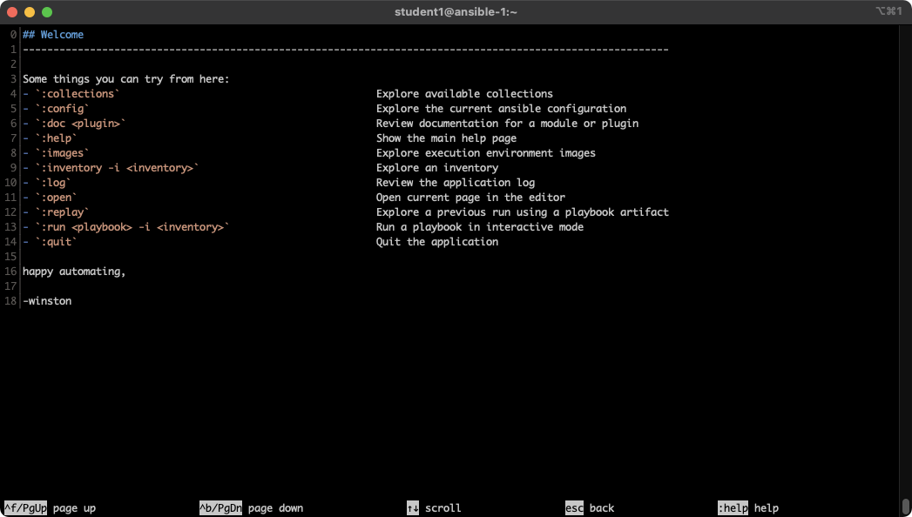
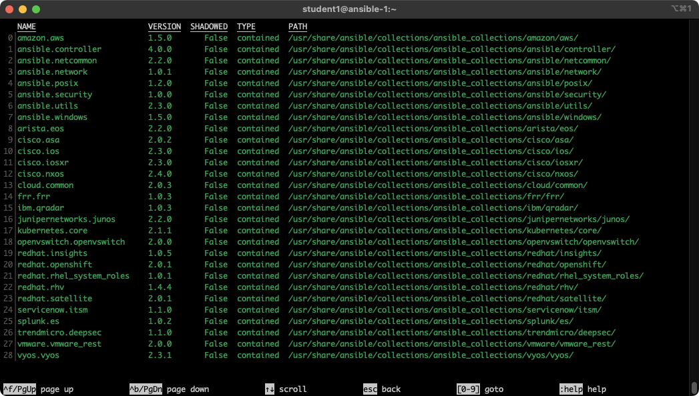
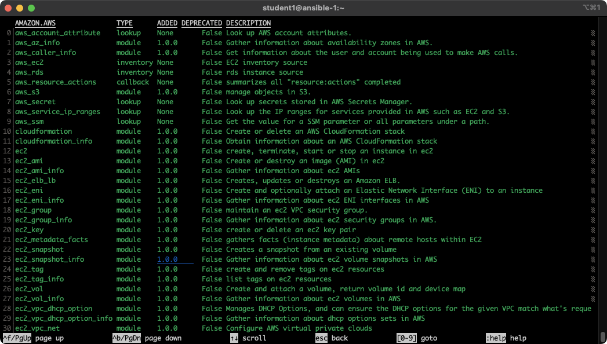
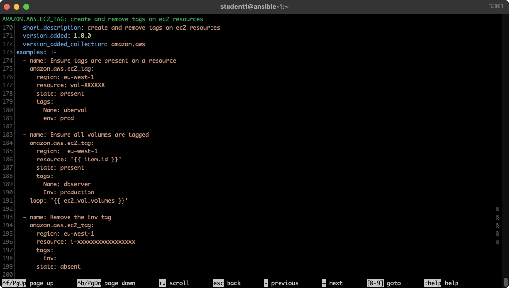
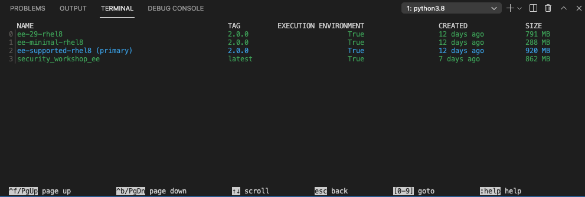
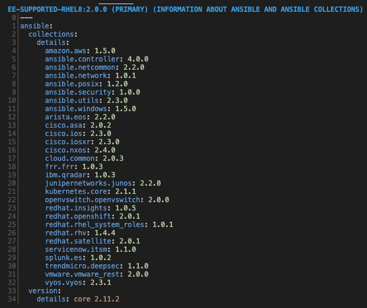

# Ansible Navigator

## Objective

In this exercise, we are going to explore the latest Ansible command line utility `ansible-navigator` to learn how to work with inventory files and the listing of modules when needing assistance. The goal is to familiarize yourself with how `ansible-navigator` works and how it can be used to enrich your Ansible experience.

This exercise will cover

* Working with inventory files
* Locating and understanding an `ini` formatted inventory file
* Listing modules and getting help when trying to use them

## Guide

With the introduction of Ansible Automation Platform 2, several new key components are being introduced as a part of the overall developer experience. Execution environments have been introduced to provide predictable environments to be used during automation runtime. All collection dependencies are contained within the execution environment to ensure that automation created in development environments runs the same as in production environments.

What do you find within an execution environment?

* RHEL UBI 8
* Ansible 2.9 or Ansible Core 2.11
* Python 3.8
* Any content Collections
* Collection python or binary dependencies.

Why use execution environments?

They provide a standardized way to define, build and distribute the environments that the automation runs in. In a nutshell, Automation execution environments are container images that allow for easier administration of Ansible by the platform administrator.

Considering the shift towards containerized execution of automation, automation development workflow and tooling that existed before Ansible Automation Platform 2 have had to be re-imagined. In short, `ansible-navigator` replaces `ansible-playbook` and other `ansible-*` command line utilities.

With this change, Ansible playbooks are executed using the `ansible-navigator` command on the control node.

The prerequisites and best practices for using `ansible-navigator` have been done for you within this lab.

These include:

* Installing the `ansible-navigator` package
* Creating a default settings `/home/student/.ansible-navigator.yml` for all your projects (optional)
* All execution environment (EE) logs are stored within `/home/student/.ansible-navigator/logs/ansible-navigator.log`
* Playbook artifacts are saved under `/tmp/artifact.json`

Follow the next link for more information on the [Ansible navigator settings](https://ansible.readthedocs.io/projects/navigator/settings/#the-ansible-navigator-settings-file){:target="_blank"}.

!!! tip
    The parameters for ansible-navigator maybe modified for your specific environment. The current settings use a default `ansible-navigator.yml` for all projects, but a specific `ansible-navigator.yml` can be created for each project and is the recommended practice.

A useful *ansible-navigator*-configuration for the workshop environment is the following, create a new file in your project directory `/home/student/ansible-files/ansible-navigator.yml` and paste in this configuration:

```yaml
---
ansible-navigator:
  ansible:
# Specify an inventory file path or comma separated host list
    inventories:
      - /home/student/lab_inventory/hosts
# Sets configuration for  the creation of artifacts for completed playbooks.
# Can be enabled or disabled and specify filename and location
  playbook-artifact:
    enable: true
    save-as: ~/ansible-files/artifacts/{playbook_name}-artifact-{ts_utc}.json
# Set user interface mode, either 'stdout' or 'interactive'
# Mode 'stdout' ensures same output method as with ansible-playbook command
  mode: interactive

# Enable or disable the use of an execution environment and specify different options
  execution-environment:
    image: registry.redhat.io/ansible-automation-platform-20-early-access/ee-supported-rhel8:2.0.0
    enabled: true
    container-engine: podman
    pull-policy: missing
    volume-mounts:
      - src: "/etc/ansible/"
        dest: "/etc/ansible/"
```

Adjust the path to your inventory file, as well as the used container image if a newer image is used in the default *ansible-navigator*-configuration.

### Step 1 - Work with your Inventory

An inventory file is a text file that specifies the nodes that will be managed by the control machine. The nodes to be managed may include a list of hostnames or IP addresses of those nodes. The inventory file allows for nodes to be organized into groups by declaring a host group name within square brackets ([]).

To use the `ansible-navigator` command for host management, you need to provide an inventory file which defines a list of hosts to be managed from the control node. In this lab, the inventory is provided by your instructor. The inventory file is an `ini` formatted file listing your hosts, sorted in groups, additionally providing some variables. It looks like:

``` { .ini .no-copy }
[web]
node1 ansible_host=<X.X.X.X>
node2 ansible_host=<Y.Y.Y.Y>
node3 ansible_host=<Z.Z.Z.Z>

[control]
ansible-1 ansible_host=44.55.66.77
```

Ansible is already configured to use the inventory specific to your environment. We will show you in the next step how that is done. For now, we will execute some simple commands to work with the inventory.

To reference all the inventory hosts, you supply a pattern to the `ansible-navigator` command. `ansible-navigator inventory` has a `--list` option which can be useful for displaying all the hosts that are part of an inventory file including what groups they are associated with.

=== "Navigator"

    ``` { .console .no-copy }
    [student@ansible-1 ~]$ ansible-navigator inventory --list -m stdout
    {
        "_meta": {
            "hostvars": {
                "ansible-1": {
                    "ansible_host": "3.236.186.92"},
                "node1": {
                    "ansible_host": "3.239.234.187"
                },
                "node2": {
                    "ansible_host": "75.101.228.151"
                },
                "node3": {
                    "ansible_host": "100.27.38.142"
                }
            }
        },
        "all": {
            "children": [
                "control",
                "ungrouped",
                "web"
            ]
        },
        "control": {
            "hosts": [
                "ansible-1"
            ]
        },
        "web": {
            "hosts": [
                "node1",
                "node2",
                "node3"
            ]
        }
    }

    ```

=== "Ansible"

    ``` { .console .no-copy }
    [student@ansible-1 ~]$ ansible-inventory --list
    {
        "_meta": {
            "hostvars": {
                "ansible-1": {
                    "ansible_host": "3.236.186.92"},
                "node1": {
                    "ansible_host": "3.239.234.187"
                },
                "node2": {
                    "ansible_host": "75.101.228.151"
                },
                "node3": {
                    "ansible_host": "100.27.38.142"
                }
            }
        },
        "all": {
            "children": [
                "control",
                "ungrouped",
                "web"
            ]
        },
        "control": {
            "hosts": [
                "ansible-1"
            ]
        },
        "web": {
            "hosts": [
                "node1",
                "node2",
                "node3"
            ]
        }
    }
    ```

!!! note
    `-m` is short for `--mode` which allows for the mode to be switched to standard output instead of using the text-based user interface (TUI).

If the `--list` is too verbose, the option of `--graph` can be used to provide a more condensed version of `--list`.

=== "Navigator"

    ``` { .console .no-copy }
    [student@ansible-1 ~]$ ansible-navigator inventory --graph -m stdout
    @all:
    |--@control:
    |  |--ansible-1
    |--@ungrouped:
    |--@web:
    |  |--node1
    |  |--node2
    |  |--node3
    ```

=== "Ansible"

    ``` { .console .no-copy }
    [student@ansible-1 ~]$ ansible-inventory --graph
    @all:
    |--@control:
    |  |--ansible-1
    |--@ungrouped:
    |--@web:
    |  |--node1
    |  |--node2
    |  |--node3

    ```

We can clearly see that nodes: `node1`, `node2`, `node3` are part of the `web` group, while `ansible-1` is part of the `control` group.

An inventory file can contain a lot more information, it can organize your hosts in groups or define variables. In our example, the current inventory has the groups `web` and `control`. Run Ansible with these host patterns and observe the output:

Using the `ansible-navigator inventory` command, we can also run commands that provide information only for one host or group. For example, give the following commands a try to see their output.

``` { .console .no-copy }
[student@ansible-1 ~]$ ansible-navigator inventory --graph web -m stdout
[student@ansible-1 ~]$ ansible-navigator inventory --graph control -m stdout
[student@ansible-1 ~]$ ansible-navigator inventory --host node1 -m stdout
```

!!! tip
    The inventory can contain more data. E.g. if you have hosts that run on non-standard SSH ports you can put the port number after the hostname with a colon. Or you could define names specific to Ansible and have them point to the "real" IP or hostname.

### Step 2 - Listing Modules and Getting Help

Ansible Automation Platform comes with multiple supported Execution Environments (EEs).  These EEs come with bundled supported collections that contain supported content, including modules.  To browse your available modules first enter interactive mode:

```bash
ansible-navigator
```



!!! tip
    In `ansible-navigator` exit by pressing the button `ESC`.

First browse a collection by typing `:collections`

```bash
:collections
```



To browse the content for a specific collections, type the corresponding number.  For example in the example screenshot above the number `0` corresponds to `amazon.aws` collection.  To zoom into collection type the number `0`.

```bash
0
```



Get help for a specific module including usage by zooming in further.  For example the module `ec2_tag` corresponds to `24`.

```bash
:24
```

Scrolling down using the arrow keys or page-up and page-down can show us documentation and examples.



You can also skip directly to a particular module by simply typing `:doc namespace.collection.module-name`.  For example typing `:doc amazon.aws.ec2_tag` would skip directly to the final page shown above.

!!! tip
    Different execution environments can have access to different collections, and different versions of those collections.  By using the built-in documentation you know that it will be accurate for that particular version of the collection.

### Step 3 - Examining Execution Environments

Run the `ansible-navigator` command with the `images` argument to look at execution environments configured on the control node:

```bash
ansible-navigator images
```



!!! note
    The output  you see might differ from the above output

This command gives you information about all currently installed Execution Environments or EEs for short.  Investigate an EE by pressing the corresponding number.  For example pressing **2** with the above example will open the `ee-supported-rhel8` execution environment:


Selecting `2` for `Ansible version and collections` will show us all Ansible Collections installed on that particular EE, and the version of `ansible-core`:



### Step 4 - Examining the ansible-navigator configuration

Either use Visual Studio Code to open or use the `cat` command to view the contents of the `ansible-navigator.yml` file.  The file is located in the home directory:

``` { .console .no-copy }
$ cat ~/.ansible-navigator.yml
---
ansible-navigator:
  ansible:
    inventories:
    - /home/student/lab_inventory/hosts

  execution-environment:
    image: registry.redhat.io/ansible-automation-platform-20-early-access/ee-supported-rhel8:2.0.0
    enabled: true
    container-engine: podman
    pull-policy: missing
    volume-mounts:
    - src: "/etc/ansible/"
      dest: "/etc/ansible/"
```

Note the following parameters within the `ansible-navigator.yml` file:

* `inventories`: shows the location of the ansible inventory being used
* `execution-environment`: where the default execution environment is set

For a full listing of every configurable knob checkout the [documentation](https://ansible-navigator.readthedocs.io/en/latest/settings/){:target="_blank"}.

### Step 3 - Running the Playbook

Create a simple playbook:

```yaml
---
- name: Apache server installation
  hosts: node1
  become: true
  tasks:
    - name: Ensure Apache package is installed
      ansible.builtin.package:
        name: httpd
        state: present
```

To run your playbook, use the `ansible-navigator run <playbook>` command as follows:

``` { .console .no-copy }
[student@ansible-1 ansible-files]$ ansible-navigator run apache.yml
```

!!! tip
    The existing `ansible-navigator.yml` file provides the location of your inventory file. If this was not set within your `ansible-navigator.yml` file, the command to run the playbook would be: `ansible-navigator run apache.yml -i /home/student/lab_inventory/hosts`

When running the playbook, you'll be displayed a text user interface (TUI) that displays the play name among other information about the playbook that is currently run.

``` { .console .no-copy }
  PLAY NAME                        OK  CHANGED    UNREACHABLE      FAILED    SKIPPED    IGNORED    IN PROGRESS     TASK COUNT          PROGRESS
0│Apache server installed           2        1              0           0          0          0              0              2          COMPLETE
```

If you notice, prior to the play name `Apache server installed`, you'll see a `0`. By pressing the `0` key on your keyboard, you will be provided a new window view displaying the different tasks that ran for the playbook completion. In this example, those tasks included the "Gathering Facts" and "latest Apache version installed". The "Gathering Facts" is a built-in task that runs automatically at the beginning of each play. It collects information about the managed nodes. Exercises later on will cover this in more detail. The "latest Apache version installed" was the task created within the `apache.yml` file that installed `httpd`.

The display should look something like this:

``` { .console .no-copy }
  RESULT   HOST    NUMBER   CHANGED   TASK                              TASK ACTION    DURATION
0│OK       node1   0        False     Gathering Facts                   gather_facts   1s
1│OK       node1   1        False     latest Apache version installed   package            4s
```

Taking a closer look, you'll notice that each task is associated with a number. Task 1, "latest Apache version installed", does not show a change state, you already installed Apache yesterday, otherwise it would show a change.

By pressing `0` or `1` on your keyboard, you can see further details of the task being run. If a more traditional output view is desired, type `:st` within the text user interface.

Once you've completed, reviewing your Ansible playbook, you can exit out of the TUI via the Esc key on your keyboard.

!!! tip
    The *Esc* key only takes you back to the previous screen. Once at the main overview screen an additional *Esc* key will take you back to the terminal window.

Once the playbook has completed, connect to `node1` via SSH to make sure Apache has been installed. You may also skip this, as you did this yesterday.

``` { .console .no-copy }
[student@ansible-1 ansible-files]$ ssh node1
Last login: Wed May 15 14:03:45 2019 from 44.55.66.77
Managed by Ansible
```

Use the command `rpm -qi httpd` to verify httpd is installed:

``` { .console .no-copy }
[ec2-user@node1 ~]$ rpm -qi httpd
Name        : httpd
Version     : 2.4.37
[...]
```

Log out of `node1` with the command `exit` so that you are back on the control host and verify the installed package with an Ansible playbook labeled `package.yml`

```yaml
---
- name: Check packages
  hosts: node1
  become: true
  vars:
    package: "httpd"
  tasks:
    - name: Gather the package facts
      ansible.builtin.package_facts:
        manager: auto

    - name: Output message if package is installed
      ansible.builtin.debug:
        msg: "{{ package }} in Version {{ ansible_facts.packages[package][0].version }} is installed!"
```

``` { .console .no-copy }
[student@ansible-1 ~]$ ansible-navigator run package.yml -m stdout
```

``` { .console .no-copy }
PLAY [Check packages] **********************************************************
TASK [Gathering Facts] *********************************************************
ok: [ansible]
TASK [Gather the package facts] ************************************************
ok: [ansible]
TASK [Check whether a httpd  is installed] *************************************
ok: [ansible] => {
    "msg": "httpd 2.4.37 is installed!"
}
PLAY RECAP *********************************************************************
ansible                    : ok=3    changed=0    unreachable=0    failed=0    skipped=0    rescued=0    ignored=0  
```

### Step 5 - Extend your Playbook: Create an web.html

Check that the tasks were executed correctly and Apache is accepting connections: Make an HTTP request using Ansible’s `uri` module in a playbook named check_httpd.yml from the control node to `node1`.

```yaml
---
- name: Check URL
  hosts: control
  vars:
    node: "node1"
  tasks:
    - name: Check that you can connect (GET) to a page and it returns a status 200
      ansible.builtin.uri:
        url: "http://{{ node }}"
```

!!! warning
    **Expect a lot of red lines and a 403 status\!**

``` { .console .no-copy }
[student@ansible-1 ~]$ ansible-navigator run check_httpd.yml -m stdout
```

There are a lot of red lines and an error: As long as there is not at least an `web.html` file to be served by Apache, it will throw an ugly "HTTP Error 403: Forbidden" status and Ansible will report an error.

So why not use Ansible to deploy a simple `web.html` file? On the ansible control host, as the `student` user, create the directory `files` to hold file resources in `~/ansible-files/`:

``` { .console .no-copy }
[student@ansible-1 ansible-files]$ mkdir files
```

Then create the file `~/ansible-files/files/web.html` on the control node:

```html
<body>
<h1>Apache is running fine</h1>
</body>
```

In a previous example, you used Ansible’s `copy` module to write text supplied on the command line into a file. Now you’ll use the module in your playbook to copy a file.

On the control node as your student user edit the file `~/ansible-files/apache.yml` and add a new task utilizing the `copy` module. It should now look like this:

```yaml
---
- name: Apache server installation
  hosts: node1
  become: true
  tasks:
    - name: Install Apache package
      ansible.builtin.package:
        name: httpd
        state: present

    - name: Ensure Apache is enabled and running
      ansible.builtin.service:
        name: httpd.service
        enabled: true
        state: started

    - name: Copy file for webserver index
      ansible.builtin.copy:
        src: web.html
        dest: /var/www/html/index.html
        mode: "0644"
```

What does this new copy task do? The new task uses the `copy` module and defines the source and destination options for the copy operation as parameters.

Run your extended Playbook:

``` { .console .no-copy }
[student@ansible-1 ansible-files]$ ansible-navigator run apache.yml -m stdout
```

* Have a good look at the output, notice the changes of "CHANGED" and the tasks associated with that change.

* Run the Ansible playbook check_httpd.yml using the "uri" module from above again to test Apache. The command should now return a friendly green "status: 200" line, amongst other information.

### Step 6 - Practice: Apply to Multiple Host

While the above, shows the simplicity of applying changes to a particular host. What about if you want to set changes to many hosts? This is where you'll notice the real power of Ansible as it applies the same set of tasks reliably to many hosts.

* So what about changing the apache.yml Playbook to run on `node1` **and** `node2` **and** `node3`?

As you might remember, the inventory lists all nodes as members of the group `web`:

``` { .ini .no-copy }
[web]
node1 ansible_host=node1.example.com
node2 ansible_host=node2.example.com
node3 ansible_host=node3.example.com
```

Change the playbook `hosts` parameter to point to `web` instead of `node1`:

```yaml
---
- name: Apache server installation
  hosts: web
  become: true
  tasks:
    - name: Install Apache package
      ansible.builtin.package:
        name: httpd
        state: present

    - name: Ensure Apache is enabled and running
      ansible.builtin.service:
        name: httpd.service
        enabled: true
        state: started

    - name: Copy file for webserver index
      ansible.builtin.copy:
        src: web.html
        dest: /var/www/html/index.html
        mode: "0644"
```

Now run the playbook:

``` { .console .no-copy }
[student@ansible-1 ansible-files]$ ansible-navigator run apache.yml -m stdout
```

Verify if Apache is now running on all web servers (node1, node2, node3). All output should be green.
