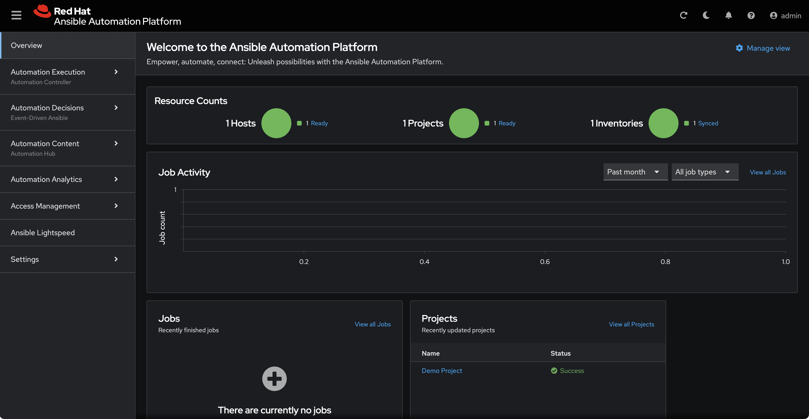

# 1 - AAP Introduction

## Objective

The following exercise will provide an Ansible automation controller overview including going through features that are provided by the Red Hat Ansible Automation Platform.  This will cover automation controller fundamentals such as:

* Job Templates
* Projects
* Inventories
* Credentials
* Workflows

## Guide

### What is Ansible Automation Platform (AAP)?

Ansible Automation Platform (AAP) is a comprehensive automation solution that provides a scalable framework for automating tasks across IT environments. It integrates various components, including automation controller, Event-Driven Ansible and automation hub offering users a unified platform for managing, executing, and orchestrating automation workflows.

* has a user-friendly dashboard.
* complements Ansible, adding automation, visual management, and monitoring capabilities.
* provides user access control to administrators.
* provides distinct _view_ and _edit_ perspectives for automation controller objects and components.
* graphically manages or synchronizes inventories with a wide variety of sources.
* has a RESTful API.
* And much more...

Some additional infos and tools of the Automation Platform offering from Red Hat include:

* [Execution Environments](https://docs.ansible.com/automation-controller/latest/html/userguide/execution_environments.html){:target="_blank"} - not specifically covered in this workshop (day 1) because the built-in Ansible Execution Environments already included all the Red Hat supported collections which includes all the collections we use for this workshop.  Execution Environments are container images that can be utilized as Ansible execution.
* [ansible-builder](https://github.com/ansible/ansible-builder){:target="_blank"} - not specifically covered in this workshop, `ansible-builder` is a command line utility to automate the process of building Execution Environments.
* [ansible-navigator](https://github.com/ansible/ansible-navigator){:target="_blank"} - a command line utility and text-based user interface (TUI) for running and developing Ansible automation content, especially for running Execution Environments. We won't cover this tool specifically in the first day, but you can always do all exercises with the Navigator if you want to.

If you need more information on new Ansible Automation Platform components bookmark this landing page [https://red.ht/AAP-20](https://red.ht/AAP-20){:target="_blank"}

### Your Ansible automation controller lab environment

In this lab you work in a pre-configured lab environment. You will have access to the following hosts:

| Role                                          | Inventory name |
| --------------------------------------------- | ---------------|
| Ansible control host & automation controller  | ansible-1      |
| Managed Host 1                                | node1          |
| Managed Host 2                                | node2          |
| Managed Host 2                                | node3          |

The Ansible automation controller provided in this lab is individually setup for you. Make sure to access the right machine whenever you work with it. Automation controller has already been installed and licensed for you, the web UI will be reachable over HTTP/HTTPS.

### Dashboard

The **automation controller** is a key component of Ansible Automation Platform. It offers a web-based interface that provides a centralized point to manage, monitor, and control automation.  
Let's have a first look at the **automation controller**: Point your browser to the URL you were given, similar to `https://controller.6rr99.sandbox2326.opentlc.com` (the current workshop ID will be different) and log in as `admin`. The password will be provided by the instructor.

The controller’s dashboard offers a real-time view of recent job activity, managed hosts and hands-on quick starts to get you started as quickly as possible with Ansible Automation Platform.

### Core Concepts

Before we dive further into using Ansible automation controller, you should get familiar with some concepts and naming conventions.

#### Projects

Logical collections of Ansible assets such as collections, roles and playbooks stored in a version control system.

#### Inventories

Collections of hosts against which automation tasks are run. Inventories can be manually defined or dynamically synchronized.

#### Credentials

Credentials are utilized by automation controller for authentication when launching Jobs against machines, synchronizing with inventory sources, and importing project content from a version control system and much more.

#### Job Templates

Defined sets of parameters that allow for the consistent execution of automation jobs from an Ansible playbook.

#### Jobs

A job is basically an instance of automation controller launching an Ansible playbook against an inventory of hosts.
