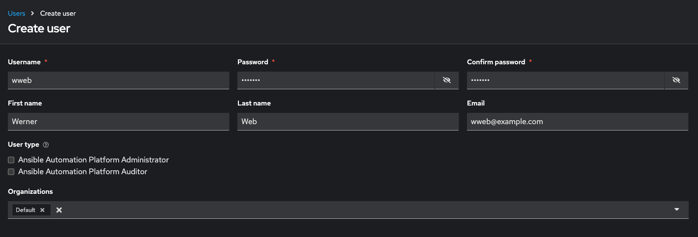

# 5 - Role-based access control

## Objective

You have already learned how Ansible automation controller separates credentials from users. Another advantage of Ansible automation controller is the user and group rights management.  This exercise demonstrates Role Based Access Control (RBAC)

## Guide

### Ansible automation controller users

There are three types of users in Ansible Automation Controller:

* **Normal User**: Has read and write access limited to assigned inventories and projects.
* **Ansible Automation Platform Auditor**: Read-only access to all objects within the automation controller environment.
* **Ansible Automation Platform Administrator**: Full admin privileges over the entire automation controller installation.

Let’s create a user:

* Navigate to **Access Management -> Users**.
* Click the **Create user** button.
* Fill in the values for the new user:

| Parameter        | Value              |
| ---------------- | ------------------ |
| Username         | `wweb`             |
| Email            | `wweb@example.com` |
| Password         | `ansible`          |
| Confirm Password | `ansible`          |
| First Name       | `Werner`           |
| Last Name        | `Web`              |
| Organization     | `Default`          |

* Click **Create user**.

### Ansible automation controller teams

A Team is a subdivision of an organization with associated users, projects, credentials, and permissions. Teams provide a means to implement role-based access control schemes and delegate responsibilities across organizations. For instance, permissions may be granted to a whole Team rather than each user on the Team.

Create a Team:

* Navigate to **Access Management -> Teams**.
* Click the **Create team** button and create a team named `Web Content` within the `Default` organization.
* Click **Create team**.

Add a user to the team:

* Select the `Web Content` team.
* Go to the **Users** tab and click **Add users**.
* In the **Add users** window, choose **wweb**, then click **Add users**.

### Granting permissions

To allow users or teams to actually do something, you have to set permissions. The user **wweb** should only be allowed to modify content of the assigned webserver.

Add the permission to use the `Create index.html` template:

* Navigate to **Automation Execution -> Templates**.
* Select the template `Create index.html`.
* Click the **User Access** tab.
* Click **Add roles**
* Select the `wweb` user and click **Next**.
* Choose the roles **JobTemplate Admin** and/or **JobTemplate Execute**, depending on the required level of access, click **Next**.
* Review the selections and click **Finish**.

### Test permissions

Now log out of automation controller’s web UI and in again as the **wweb** user.

* Navigate to **Templates**. You should only see the `Create index.html` template listed. He is allowed to view and launch, but not to edit the Template (no Edit button available).
* Run the job by clicking the rocket icon. Enter the required values for the survey questions and launch the job.
* In the following **Jobs** view have a good look around, note that there where changes to the host (as expected).

In the **Automation Execution → Infrastructure → Inventories → Workshop Inventory**, select the Hosts tab and select **node1** and click **Run Command**:

* Within the Details window, select Module command, in Arguments type `curl http://node1` and click Next.
* Within the Execution Environment window, select `Default execution environment` and click Next.
* Within the Credential window, select `Workshop Credentials` and click Next.
* Review your inputs and click Finish.

Verify that the output result is as expected.

Just recall what you have just done: You enabled a restricted user to run an Ansible playbook

* Without having access to the credentials

* Without being able to change the playbook itself

* But with the ability to change variables you predefined\!

Effectively you provided the power to execute automation to another user without handing out your credentials or giving the user the ability to change the automation code. And yet, at the same time the user can still modify things based on the surveys you created.

This capability is one of the main strengths of Ansible automation controller\!
