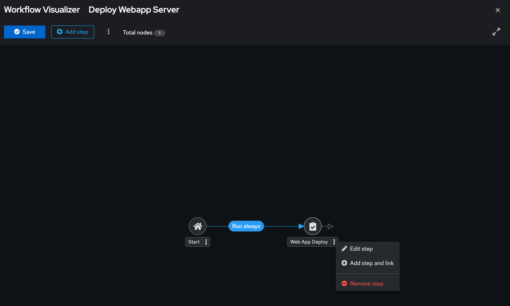
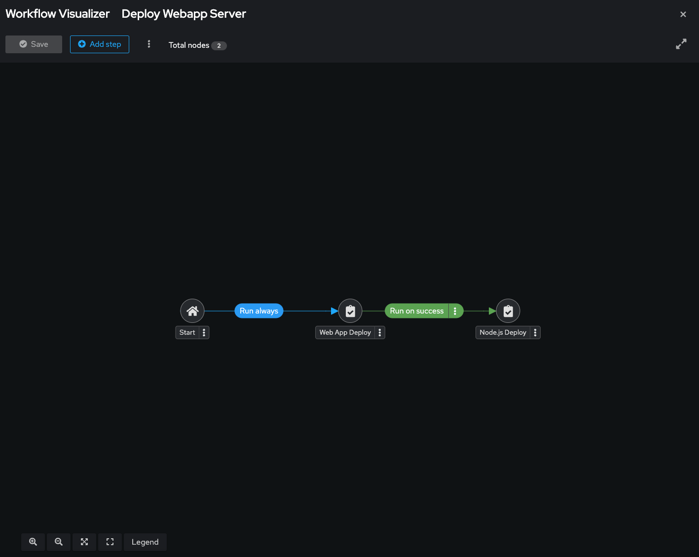

# 6 - Workflows

## Objective

The basic idea of a *workflow* is to link multiple Job Templates together. They may or may not share inventory, playbooks or even permissions. The links can be conditional:

* if job template A succeeds, job template B is automatically executed afterwards
* but in case of failure, job template C will be run.

And the workflows are not even limited to Job Templates, but can also include project or inventory updates.

This enables new applications for Ansible automation controller: different Job Templates can build upon each other. E.g. the networking team creates playbooks with their own content, in their own Git repository and even targeting their own inventory, while the operations team also has their own repos, playbooks and inventory.

In this lab you’ll learn how to setup a workflow.

## Guide

### Lab scenario

You have two departments in your organization:

* **Web operations team:** developing playbooks in their Git branch `webops`.
* **Web developers team:** working in their branch `webdev`.

When there is a new Node.js server to deploy, two things need to happen:

#### Web operations team

* Install `httpd`, `firewalld`, and `node.js`.
* Configure `SELinux` settings, open the firewall, and start `httpd` and `node.js`.

#### Web developers team

* Deploy the latest version of the web application and restart `node.js`.

In other words, the Web operations team prepares a server for application deployment, and the Web developers team deploys the application on the server.

---

To make things somewhat easier for you, everything needed already exists in a Github repository: playbooks, JSP-files etc. You just need to glue it together.

!!! note
    In this example we use two different branches of the same repository for the content of the separate teams. In reality, the structure of your Source Control repositories depends on a lot of factors and could be different.

### Set up projects

First you have to set up the Git repo as a Project like you normally would.

!!! warning
    If you are still logged in as user **wweb**, log out of and log in as user **admin**.

Within **Automation Execution → Projects**, click **Create Project** to set up the web operations team’s project: Fill out the form as follows:

| Parameter                        | Value                                                                           |
| -------------------------------- | ------------------------------------------------------------------------------- |
| Name                             | `Webops Git Repo`                                                               |
| Organization                     | `Default`                                                                       |
| Default Execution Environment    | `Default Execution Environment`                                                 |
| Source Control Credential Type   | `Git`                                                                           |
| Source Control URL               | `https://github.com/ansible/workshop-examples.git`                              |
| Source Control Branch/Tag/Commit | `webops`                                                                        |
| Options                          | :material-checkbox-outline: Clean :material-checkbox-outline: Delete :material-checkbox-outline: Update Revision on Launch |

Click **Create project**.

Repeat the process to set up the **Webdev Git Repo**, using the branch `webdev`. Fill out the form as follows:

| Parameter                        | Value                                                                           |
| -------------------------------- | ------------------------------------------------------------------------------- |
| Name                             | `Webdev Git Repo`                                                               |
| Organization                     | `Default`                                                                       |
| Default Execution Environment    | `Default Execution Environment`                                                 |
| Source Control Credential Type   | `Git`                                                                           |
| Source Control URL               | `https://github.com/ansible/workshop-examples.git`                              |
| Source Control Branch/Tag/Commit | `webdev`                                                                        |
| Options                          | :material-checkbox-outline: Clean :material-checkbox-outline: Delete :material-checkbox-outline: Update Revision on Launch |

Click **Create project**.

### Set up job templates

Now you have to create two Job Templates like you would for "normal" Jobs.

Within **Automation Execution → Templates → Create template → Create job template**, fill out the form with the following values:

| Parameter             | Value                                            |
| --------------------- | ------------------------------------------------ |
| Name                  | `Web App Deploy`                                 |
| Job Type              | `Run`                                            |
| Inventory             | `Workshop Inventory`                             |
| Project               | `Webops Git Repo`                                |
| Execution Environment | `Default execution environment`                  |
| Playbook              | `rhel/webops/web_infrastructure.yml`             |
| Credentials           | `Workshop Credentials`                            |
| Limit                 | `web`                                            |
| Options               | :material-checkbox-outline: Privilege Escalation |

Click **Create job template**.

Click **Create job template**, and then repeat the process for the **Node.js Deploy** template, changing the project to **Webdev Git Repo** and the playbook to `rhel/webdev/install_node_app.yml`.

| Parameter             | Value                                            |
| --------------------- | ------------------------------------------------ |
| Name                  | `Node.js Deploy`                                 |
| Job Type              | `Run`                                            |
| Inventory             | `Workshop Inventory`                             |
| Project               | `Webdev Git Repo`                                |
| Execution Environment | `Default execution environment`                  |
| Playbook              | `rhel/webdev/install_node_app.yml`               |
| Credentials           | `Workshop Credentials`                            |
| Limit                 | `web`                                            |
| Options               | :material-checkbox-outline: Privilege Escalation |

Click **Create job template**.

!!! tip
    If you want to know what the Ansible Playbooks look like, check out the Github URL and switch to the appropriate branches.

### Set up the workflow

Workflows are configured in the **Templates** view, you might have noticed you can choose between **Create job template** and **Create workflow job template** when adding a template.

Within **Automation Execution → Templates → Create template → Create workflow job template**, fill in the details:

| Parameter    | Value                  |
| ------------ | ---------------------- |
| Name         | `Deploy Webapp Server` |
| Organization | `Default`              |

Click **Create workflow job template** to open the **Workflow Visualizer**.

Click the **Add Step** button and assign the **Web App Deploy** job template to the first node. Add a second node by clicking the 3 dot sign, selecting the "Add step and link"  and assign the **Node.js Deploy** template with the **Run on success** status type. Select **Next** and **Finish** to complete the workflow.

Click **Save** to finalize the workflow.

!!! tip
    The run type allows for more complex workflows. You could lay out different execution paths for successful and for failed playbook runs.

### Launch workflow

Within the **Deploy Webapp Server** template, click **Launch template**.

Once the workflow completes, verify the result.

* Go to **Automation Execution → Infrastructure → Inventories → Workshop Inventory**.
* Select the Hosts tab and select `node1` and click **Run Command**.
* Within the Details window, select Module `command`, in Arguments type `curl http://node1/nodejs` and click Next.
* Within the Execution Environment window, select `Default execution environment` and click Next.
* Within the Credential window, select `Workshop Credentials` and click Next.

Review your inputs and click Finish.

Verify that the output result shows `Hello World`

!!! note
    `XX` is the number of the job run.
