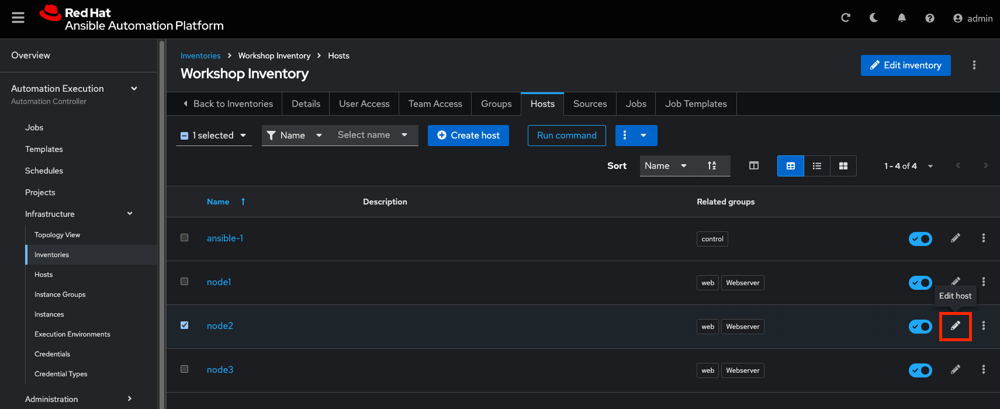
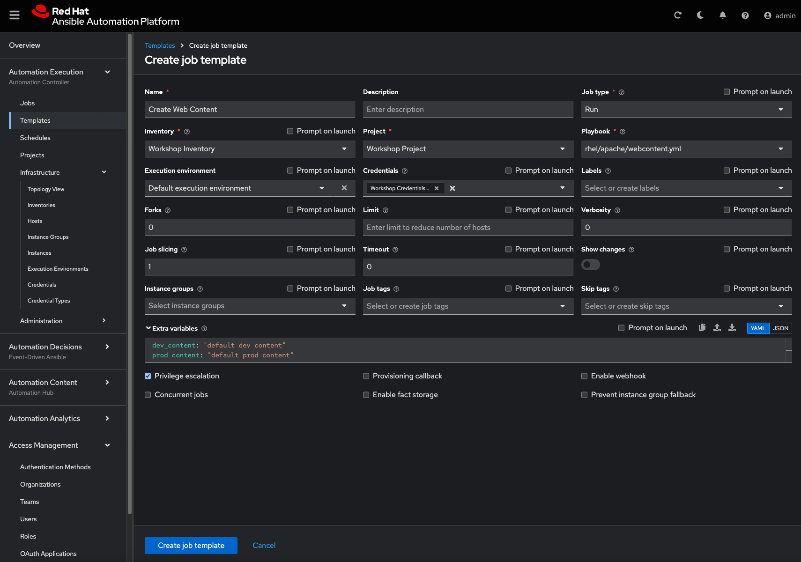

# 7 - AAP Wrap up

## Objective

This is the final challenge where we try to put most of what you have learned together.

## Guide

### Let’s set the stage

Your operations team and your application development team likes what they see in Ansible automation controller. To really use it in their environment they put together these requirements:

* All webserver hosts (`node1`, `node2` and `node3`) should go in one group

* As the webserver hosts can be used for development purposes or in production, there has to be a way to flag them accordingly as "stage dev" or "stage prod".

    * Currently `node1` and `node3` are used as a development system and `node2` is in production.

* Of course the content of the world famous application "index.html" will be different between dev and prod stages.

    * There should be a title on the page stating the environment
    * There should be a content field

* The content writer `wweb` should have access to a survey to change the content for dev and prod servers.

### The Git Repository

All code is already in place - this is a automation controller lab after all. Check out the **Workshop Project** git repository at [https://github.com/ansible/workshop-examples](https://github.com/ansible/workshop-examples){:target="_blank"}. There you will find the playbook `webcontent.yml`, which calls the role `role_webcontent`.

Compared to the previous Apache installation role there is a major difference: there are now multiple versions of an `index.html` template, and a task deploying the template file, which has a variable as part of the source file name.

For the development servers the file is named `dev_index.html.j2` with the following content:

```html
<body>
<h1>This is a development webserver, have fun!</h1>
{{ dev_content }}
</body>
```

For the production servers the file is named `prod_index.html.j2` with the following content:

```html
<body>
<h1>This is a production webserver, take care!</h1>
{{ prod_content }}
</body>
```

The playbook `main.yml` deploys the template:

```yaml
[...]
- name: Deploy index.html from template
  template:
    src: "{{ stage }}_index.html.j2"
    dest: /var/www/html/index.html
  notify: apache-restart
```

### Prepare Inventory

There is of course more then one way to accomplish this, but for the purposes of this lab, we will use Ansible automation controller.

Navigate to **Automation Execution → Infrastructure → Inventories**. Select 'Workshop Inventory' and complete the following:

* Go to the Groups tab, click **Create group**, and create a new group labeled Webserver. Click **Create group**.
* In the Webserver group, click **Edit group** and define the following variable:

```yaml
---
stage: dev
```

Within the **Details** tab of the `Webserver` inventory, click the **Hosts** tab, click the **Add existing host** button. Select `node1`, `node2`, `node3` as the hosts to be part of the `Webserver` inventory.

Within **Automation Execution → Infrastructure → Inventories**, select the `Workshop` Inventory. Click on the `Hosts` tab and click on `node2`.  Click on `Edit` and add the `stage: prod` variable in the **Variables** window. This overrides the inventory variable due to order of operations of how the variables are accessed during playbook execution.

Within the **Variables** textbox define a variable labeled `stage` with the value of `prod` and click **Save host**.

```yaml
ansible_host: node2.example.com
stage: prod
```



### Create the Template

Within **Automation Execution → Templates**, select the **Create template** button and **Create job template** as follows:

| Parameter             | Value                                                                      |
| --------------------- | -------------------------------------------------------------------------- |
| Name                  | `Create Web Content`                                                       |
| Job Type              | `Run`                                                                      |
| Inventory             | `Workshop Inventory`                                                       |
| Project               | `Workshop Project`                                                         |
| Execution Environment | `Default execution environment`                                            |
| Playbook              | `rhel/apache/webcontent.yml`                                               |
| Credentials           | `Workshop Credential`                                                      |
| Limit                 | `web`                                                                      |
| Variables             | `dev_content: "default dev content", prod_content: "default prod content"` |
| Options               | :material-checkbox-outline: Privilege Escalation                           |

Click **Create job template**.



Run the template by clicking the **Launch** button.

### Check the Results

This time we use the power of Ansible to check the results: execute uri to get the web content from each node, orchestrated by an Ansible playbook labeled `check_url.yml`

!!! tip
    We are using the `ansible_host` variable in the URL to access every node in the inventory group.

```yaml
--8<-- "wrapup-check-results-check-html-playbook.yml"
```

Execute the playbook:

``` { .console .no-copy }
[student@ansible-1 ~]$ ansible-navigator run check_url.yml -m stdout
```

Snippet of output:

``` { .console .no-copy }
TASK [debug] *******************************************************************
ok: [node1] => {
    "uri_output.content": "<body>\n<h1>This is a development webserver, have fun!</h1>\ndev wweb</body>\n"
}
ok: [node2] => {
    "uri_output.content": "<body>\n<h1>This is a production webserver, take care!</h1>\nprod wweb</body>\n"
}
ok: [node3] => {
    "uri_output.content": "<body>\n<h1>This is a development webserver, have fun!</h1>\ndev wweb</body>\n"
}
```

### Add Survey

* Add a Survey to the template to allow changing the variables `dev_content` and `prod_content`.
* In the Template, click the **Survey** tab and click the **Create survey question** button.
* Fill out the following information:

| Parameter            | Value                                      |
| -------------------- | ------------------------------------------ |
| Question             | `What should the value of dev_content be?` |
| Answer Variable Name | `dev_content`                              |
| Answer Type          | `Text`                                     |

* Click **Create survey question**

In the same fashion add a second **Survey Question**

| Parameter            | Value                                      |
| -------------------- | ------------------------------------------ |
| Question             | `What should the value of prod_content be?` |
| Answer Variable Name | `prod_content`                              |
| Answer Type          | `Text`                                     |

* Click **Create survey question**
* Click the toggle **Survey disabled** to enable the Survey questions.

* Add permissions to the team `Web Content` so the template **Create Web Content** can be executed by `wweb`.
* Within the **Automation Execution** -> **Templates**, click **Create Web Content** select the  **User Access** tab and **Add roles**  to add the user `wweb` the ability to execute the template.
    * **Select user(s)** -> select the checkbox `wweb`, click **Next**.
    * **Select roles to apply** -> select the checkbox **JobTemplate Execute** and click **Next**.
    * **Review** -> click **Finish**.
* Run the survey as user `wweb`
    * Logout of the user `admin` of your Ansible automation controller.
    * Login as `wweb` and go to **Automation execution** -> **Templates** and run the **Create Web Content** template.

Check the results again from your automation controller host. We will use the dedicated `uri` module within an Ansible playbook. As arguments it needs the actual URL and a flag to output the body in the results.

``` { .console .no-copy }
[student@ansible-1 ~]$ ansible-navigator run check_url.yml -m stdout
```

### Solution

!!! warning
    **No solution this time :sweat_smile:**

You have done all the required configuration steps in the lab already. If unsure, just refer back to the respective chapters.
