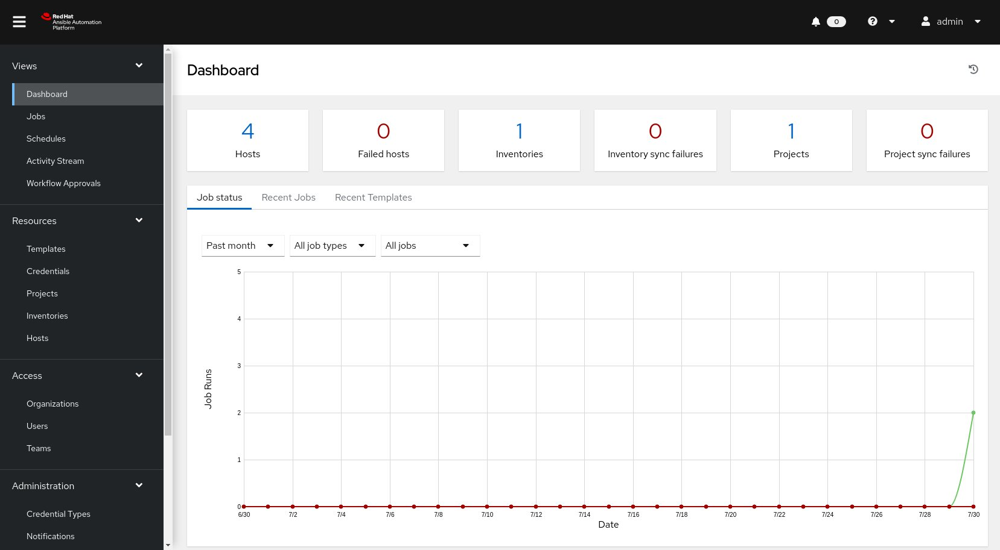

# 2.1 - Introduction

## Objective

The following exercise will provide an Ansible automation controller overview including going through features that are provided by the Red Hat Ansible Automation Platform.  This will cover automation controller fundamentals such as:

* Job Templates
* Projects
* Inventories
* Credentials
* Workflows

## Guide

### Why Ansible automation controller?

Automation controller is a web-based UI that provides an enterprise solution for IT automation. It

* has a user-friendly dashboard.
* complements Ansible, adding automation, visual management, and monitoring capabilities.
* provides user access control to administrators.
* provides distinct _view_ and _edit_ perspectives for automation controller objects and components.
* graphically manages or synchronizes inventories with a wide variety of sources.
* has a RESTful API.
* And much more...

### Your Ansible automation controller lab environment

In this lab you work in a pre-configured lab environment. You will have access to the following hosts:

| Role                                          | Inventory name |
| --------------------------------------------- | ---------------|
| Ansible control host & automation controller  | ansible-1      |
| Managed Host 1                                | node1          |
| Managed Host 2                                | node2          |
| Managed Host 2                                | node3          |

The Ansible automation controller provided in this lab is individually setup for you. Make sure to access the right machine whenever you work with it. Automation controller has already been installed and licensed for you, the web UI will be reachable over HTTP/HTTPS.

### Dashboard

Let's have a first look at the automation controller: Point your browser to the URL you were given, similar to `https://student<X>.<workshopname>.demoredhat.com` (replace `<X>` with your student number and `workshopname` with the name of your current workshop) and log in as `admin`. The password will be provided by the instructor.

The web UI of automation controller greets you with a dashboard with a graph showing:

* recent job activity
* the number of managed hosts
* quick pointers to lists of hosts with problems.

The dashboard also displays real time data about the execution of tasks completed in playbooks.

### Concepts

Before we dive further into using Ansible automation controller, you should get familiar with some concepts and naming conventions.

#### Projects

Projects are logical collections of Ansible playbooks in Ansible automation controller. These playbooks either reside on the Ansible automation controller instance, or in a source code version control system supported by automation controller.

#### Inventories

An Inventory is a collection of hosts against which jobs may be launched, the same as an Ansible inventory file. Inventories are divided into groups and these groups contain the actual hosts. Groups may be populated manually, by entering host names into automation controller, from one of Ansible Automation controller’s supported cloud providers or through dynamic inventory scripts.

#### Credentials

Credentials are utilized by automation controller for authentication when launching Jobs against machines, synchronizing with inventory sources, and importing project content from a version control system. Credential configuration can be found in the Settings.

automation controller credentials are imported and stored encrypted in automation controller, and are not retrievable in plain text on the command line by any user. You can grant users and teams the ability to use these credentials, without actually exposing the credential to the user.

#### Templates

A job template is a definition and set of parameters for running an Ansible job. Job templates are useful to execute the same job many times. Job templates also encourage the reuse of Ansible playbook content and collaboration between teams. To execute a job, automation Controller requires that you first create a job template.

#### Jobs

A job is basically an instance of automation controller launching an Ansible playbook against an inventory of hosts.
